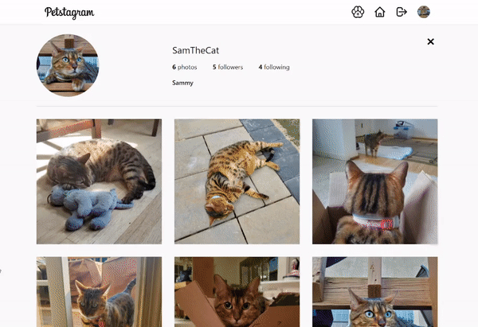

# Petstagram

<a href="https://kfig21.github.io/petstagram/" target="_blank" rel="noopener noreferrer">View the project here!</a> 👀

<h3>Summary</h3>

This was the final project for <a href="https://www.theodinproject.com/paths/full-stack-javascript/courses/nodejs/lessons/javascript-final-project" target="_blank" rel="noopener noreferrer">The Odin Project's</a> JavaScript curriculum. The goal of the project is to build/re-create a functional social media platform with a backend. This project is closely modeled after instagram, it was made with the React JS Library, Tailwind CSS, and Firebase.

 <h3>Features:</h3>
 <ul>
  <li>Responsive design</li>
  <li>Create a profile</li>
  <li>Signup/Login/Logout authentication</li>
  <li>Upload a profile picture, with the ability to crop</li>
  <li>Post a picture, with the ability to crop</li>
  <li>Like/Unlike pictures</li>
  <li>Comment on pictures</li>
  <li>Likes and comments update in realtime</li>
  <li>Follow/Unfollow other users</li>
  <li>Delete pictures posted</li>
  <li>Delete comments posted</li>
  <li>Delete profile</li>
 </ul>
 
<h3>Demo GIF</h3>

<h4>Desktop</h4>

<h4>Mobile</h4>

---

<h3>Thanks for checking out my project! Any && all feedback is appreciated!</h3>
